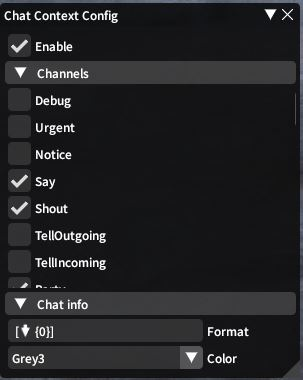
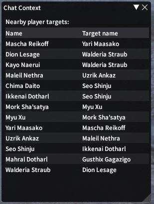

# ChatContext

Dalamud plugin to add sender target to chat messages (more features later maybe?).

## Screenshots

### Chat

### Config

### Nearby (main)

## Commands

- `/chatcontext main`
- `/chatcontext config`
- `/chatcontext enable`
- `/chatcontext disable`